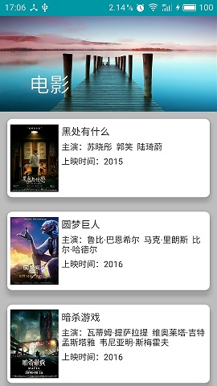

##plug
  这是我自己搭建的开源框架，采用MVP模式搭建，使用dagger2来解耦，使用databinding来进行数据绑定，
网络架构准备使用retrofit，rxjava+rxAndroid也会在这里面采用。
###TODO
   * 封装MVP框架，搭建好dagger2
   * 封装网络架构
   * 进行测试用例的编写
   * 进行具体业务的编写
   * 测试
完成了电影首页获取最新电影列表以及电影详情数据的获取，这里主要用的是豆瓣的开放API，需要的自己去查
###eg:

